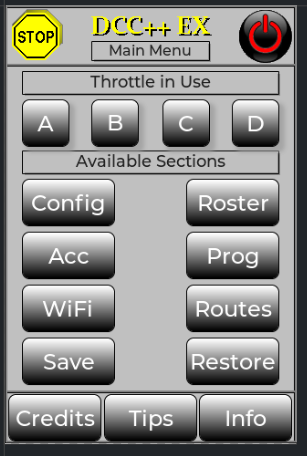
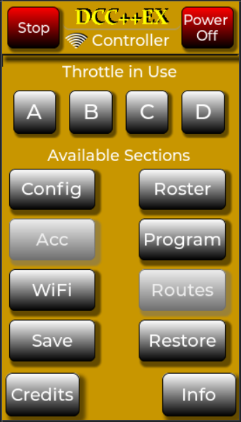
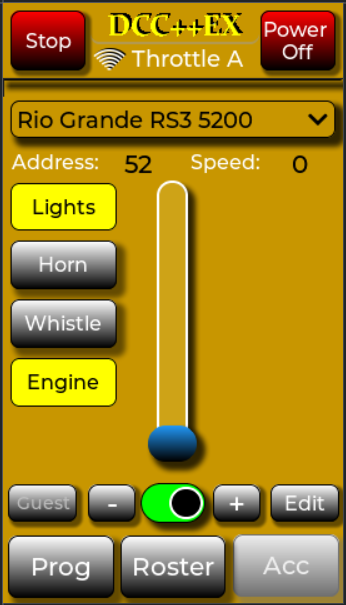
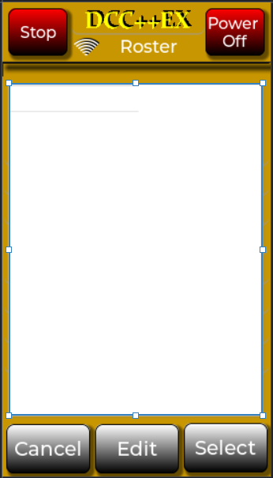
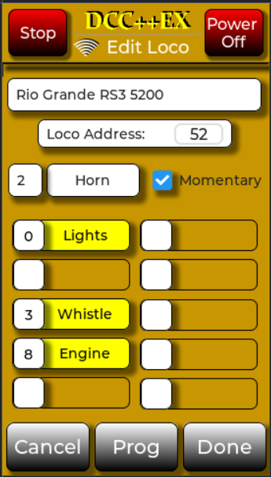
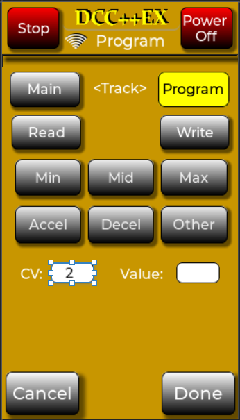
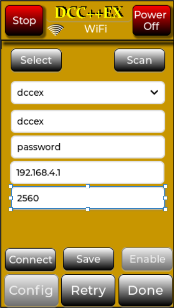
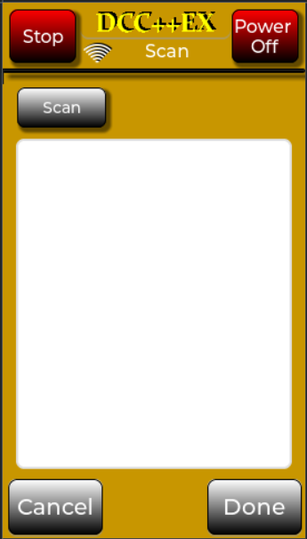
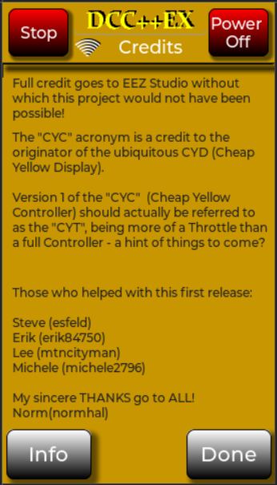
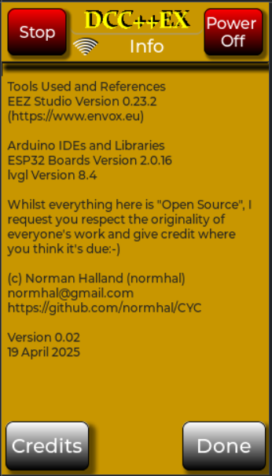

# CYC

# Cheap Yellow Controller

In an effort to grow my mediocre C++ skills, my previous project using Nextion Displays
needed some more wings. The advent of what soon became widely known as the "CYD" or
Cheap Yellow Display piqued my interest. I'm not sure who it was who devised the name, but if I recall 
it was an English YouTuber who I came across while browsing. (Update -I suspect his name is Brian Lough 
from Ireland and has a GitHub page at https://github.com/witnessmenow/). This caught my attention
as the Nextion Project had a downside when the price of the devices was considered.

While browsing around for "where to buy" I discovered that there was an increasing
range of relatively affordable TFT touch displays (very similar to the CYD) which included an integrated ESP32.
Shortly after that, I came across two Graphical Design packages - Squareline Studio, 
and at about the same time, EEZ Studio. The latter being a free to use program making it
a likely candidate.

The project was born. Here is a picture of the first "Proof of Concept", designed with EEZ Studio. The "Stop"
and "Power" images came directly from my arsenal of images created for the Nextions.

# Design Objective

Early discussions with existing members of the Nextion group resulted in a spec
list I've largely adhered to:

- Open Source design for hobbyists
- Limited new investment required
- Nextion "Controller" features:
    - WiFi connectivity
    - Support for a range of Display Sizes
    - Multiple Locos (at least 10) instantly accessible 
    - up to 10 functions for each Loco
    - a Rotary Encoder for Loco Speed and Direction to supplement the Touch facility
    - A Roster or Inventory of at least 40 Locos
    - The ability to dynamically configure "favourite" locos
    - An Editable repository of Turnouts/Switches
    - Some very basic Routes
    - DCC++ and DCC-EX compatibility
    
# Version 1.0 of the "CYC" - a Cheap Yellow Controller

For close to 12 months, progress has been slow, but steady. Here is an image of the First Page of the Controller available for download now. All the following images are taken from the EEZ Studio project for the 4.3in 272x480 resolution display. Other models all have the same basic design with only a slight variance of the images sizes and fonts used.

As you can see, the Accessories and Routes have been greyed out for later. 

# CYC Features

Four display resolutions are supported from a range of 12 Displays

-    240x320 for the Classic "Cheap Yellow Display" (CYD)
-    240x320 for a LilyGo T-HMI Display (Excellent IPS display)
-    320x480 for both a Capacitive and Resistive touch 3.5in display
-    272x480 for both a Capacitive and Resistive touch 4.3in display
-    480x800 for Resistive and Capacitive 4.3 and 5.0in displays

Support for a 480x480 4.0in and a 7.0in will be available on request.

Classic CYD and 3.5in displays house a ESP32 Wroom processor - all the others use an ESP32-S3

There is a Single Arduino sketch, which allows for the selection of the Display 
size and resolution of choice.

The current CYC Version supports:
- a Roster of up to 100 Locos
- Four individually configurable "Throttles" of up to 10 Locos each
    - These four have proved useful where multiple layouts are controlled
- WiFi Connectivity with credentials for up to 10 Networks
- Loco Programming on Program (Read and Write) or Main Track (Write Only for now)
- Sadly, to date I have not been able to interface a Rotary Encoder

Development currently includes support for Accessories and integration with 
DCCEXProtocol and Ex-Rail.

# Getting Started - What You'll Need

Before we get started, it'll be of some interest that compiling, building and getting to the point of actually using the Controller can take quite a few steps and a fair bit of time. I have found simply compiling the sketch on a Windows system can take anywhere up to 20 minutes! This can be pretty frustrating when a simple setting in the "tools" section was omitted or forgotten. For this reason, I have switched to developing and compiling on an uBuntu Linux system - compile times around 2 minutes, and only a few seconds for repeat compiles.

To help get around this problem, as a development team we have started using a batch file system with pre-compiled binaries to load both the sketch and LittleFS files. The complete process takes a matter of seconds and your display is ready for use. If you'd like to try this method, open the "Flashing" folder in the "Main" branch of this repository, where you will find a collection of batch files - one for each supported display variant.

Note that 2 executable files are required - esptool.exe and mklittlefs.exe. You can find both of these executables on your system (if you program ESP32 products:-)) but for your convenience I have stored both in the "Flashing" folder. I'm not sure of the restictions regarding distributing these executables so have not included them in the batch file folders. You will need to locate and place them in the folder which contains the Batch file before running it.

After successfully running the batch files, the Controller should be ready for use and your own customization - no mess, no fuss:-)

The nexts few points apply for those who wish to "roll-their own" or simply experiment. All source files for both the Arduino sketch and any of the supported Display boards can be found in the "Master" branch. In addition to these, you'll need:-

1. A Display with integrated ESP32
    - This is a design preference, and not a restriction - I'd like to see a Rasberry Pi Pico W based configuration
    - I have found AliExpress to be an excellent source for getting them. Here is a selection of available models from them:
    - https://www.aliexpress.com/item/1005006625220768.html
    - https://www.aliexpress.com/item/1005006729377800.html
    - https://www.aliexpress.com/item/1005004788147691.html
    - https://www.aliexpress.com/item/1005006715794302.html
   
    Note that various sub-models are listed - be careful when you select. The choice between Capacitive or Resistive touch is a personal one - the Controller Sketch supports both. Also note that these are examples of what's available. Whilst the entry level basic CYD 2.8in 240x320 resolution display is supported, the display size and appearance is certainly not the best. Most of us have found the 4.3in models ideal, with the 480x800 IPS display being the best. That being said, the 4.3in, 272x480 resolution Resistive touch unit fits the bill perfectly:-)

2. An Arduino IDE setup with the following Libraries:-

    - ESP32 Board support package up to 2.0.17 - Important!
      Version 3.x is supported, but results in a compiled binary 200k larger:-(
    - LVGL version 8.4 - Important!
    - CSV_Parser latest Version
    - TAMC_GT911 for the capacitive displays
    - Resistive displays need the included xpt2046 Library
      A more generic version of the Library is under review
    - Arduino_GFX_Library Latest Version
  
3. What's in the Master Branch of this repository:

   This project is made up from two "major" development projects - the Arduino IDE and EEZ Studio.
   -    EEZ Studio has five different projects - one for each supported display resolution. 
   -    The Arduino IDE (2.x or 1.8.19) has only one Sketch, which integrates with the desired EEZ Studio project and display model of choice to produce the resultant sketch.
   -    To make this slightly easier for you to build the correct version for your display, I have included pre-configured combinations for your convenience. In summary:
         - The CYC folder is "unconfigured" and there is no guarantee which was the last configuration built from it. If you choose to "roll-your-own", you'll need to also load EEZ Studio so as to output the correct source files for your display resolution.
         - CYC-2432-CYD is a folder ready to be compiled for the ubiquitous CYD display - 240x320 resolution and Resistive Touch
         - CYC-2432-THMI is specific to the LilyGo T-HMI (beautiful IPS) variant
         - CYC-3248 can be configured for 320x480 resolution Resistive, Capacitive or a specific JC3248W535C Capacitive model
         - CYC-4827 can also be configured for 272 x480 resolution Resistive or Capacitive Touch displays
         - CYC-8048 supports 3 480x800 units - all Capacitive at this stage, but 4.3 and 5.0in Sunton TFTs work.
    
    As at 30 April, 2025, the "Flashing" folder in the "Main" branch contains the full list of currently supported and tested display modules.
   
# Setting up Arduino IDE

Both 2.3.6 and 1.8.19 have been used successfully. Be warned that the compilation time
on a Windows 10 or 11 machine can take anywhere around 20 minutes. Getting the 
setup correct before starting can thus save a lot of frustration. 

I personally have switched to using Linux because the compile time is reduced to 
close to 2 minutes for a full compile, and a couple of seconds for updates.

1. Install or update the ESP32 boards package to version 2.0.16 or .17
2. Install the LVGL library from the Arduino Library Manager. Be sure to select 
   version 8.4
3. Copy the "lv_conf.h" file included in this repository into your Arduino 
   "libraries" folder at the same level as the "lvgl" folder - Do NOT Omit this step:-)
4. Install the xpt2046 library included here for resistive displays
5. Install the TAMC_GT911 library for Capacitive displays from the Arduino Library Manager
6. Install the CSV_Parser library also from the Arduino Library Manager
7. Install the Arduino GFX Library (by moononournation) - latest version
8. It's optional to install EEZ Studio. This would only be needed if you choose tp "roll-your-own" when using the "CYC" folder

# Setup for ESP32

If you're using a Classic CYD or either of the 3.5in Sunton displays there is
only one setting in the Arduino "tools" section to change for the ESP32:-

"Partition Scheme: "Minimal SPIFFS(1.9MB App with OTA/190kB SPIFFS)"

# Setup for ESP32-S3

There are three important settings which need to be set
- Flash Size: 16MB
  - One exception to this is when the ESP32-S3 based Display you're using only has 4MB, then change only this line accordingly
- Partition Scheme: "Minimal SPIFFS(1.9MB APP with OTA/190kB SPIFFS)"
- PSRAM: "OPI PSRAM"

The CYC Sketch uses LittleFS to store the Roster, Credentials and other 
configuration values. Whilst not necessary, the included "data" folder contains
files you can edit to pre-load the Controller with your preferences.

# Setting up LittleFS

In order to use LittleFS, the Arduino IDE needs to be configured with a plugin 
to facilitate the loading of data files. The procedures for Versions 1.8.19 are different, so proceed as follows:-

# For Arduino IDE 1.8.19

Follow the instructions here: https://github.com/earlephilhower/arduino-esp8266littlefs-plugin

# For Arduino IDE 2.x.x

https://github.com/earlephilhower/arduino-littlefs-upload/releases

Follow the instructions there to copy the provided file into a "plugins" folder you might need to create

Once the Sketch has compiled correctly and the above steps have been taken to facilitate the uploads,
the sample data files can be loaded into the LittleFS file system.

With Arduino IDE 1.8.19 you'll notice a new entry in the "Tools" dropdown, which will upload the data to the ESP32.
With Version 2.x.x of the IDE press "ctrl-shift-P" and the command dropdown will appear. The very last entry 
enables the Upload of Data files to LittleFS. Select that option and the data files will be loaded. On some 
systems if the Serial Monitor has been previously opened the Upload fails with a message that there is no Serial Port. 
Exit the IDE and then reload it without opening the Serial Monitor, and the Upload process should complete successfully.

# Your First Use

If all has completed successfully, you should be presented with the Menu Page as shown above, and you should be able to
browse around. Here are some specific Tips for each of the Pages...

The first tip which applies to ALL pages is that the "DCC++EX" image at the top of each page is a button which returns 
you immediately to the Menu Page. The nature of LVGL and EEZ Studio is that if you subsequently return to the page you 
just left, everything will be as it was when you exited.

# Throttle Page

You have 4 "Throttles" accessible to you - A, B, C and D. The throttle you select will become the "Active Throttle" for 
all loco activities until you select another. When you make your selection, that throttle ID is indicated in the Throttle 
Page heading.

#  Notes on Throttle Buttons

"Stop" button sets the loco you're currently controlling to speed 0. Note that other locos you may have left running will not be affected.
A feature is in development which will stop all locos configured for the active Throttle.

"Power" Button Controls Layout power:-)

Touching the Loco Name field opens a Dropdown list of up to 10 favourite locos. Touching any one on the list will make it become the "Active" Loco, together with its current direction and speed as well as its functions with their current states.

The actual Throttle components are self explanatory, however some mention regarding Functions might be helpful.
There are a total of 10 function "slots" available for each Loco. The slots are located in two columns of 5 each. Any slot can contain 
any one of 28 functions so that you can arrange each loco's functions as you prefer. 
If you loaded the sample LittleFS files, the initial page of Throttle A will contain a Rio Grande Loco with Address 52 and will have 
four functions arranged in a column on the Left of the Slider - Top to bottom:- Lights, Whistle, Horn and Engine.
By Pressing the "Edit" Button, you will be presented with a Page where all details can be edited. 
Function editing uses a unique technique which makes re-arranging each function extremely easy.
As an example, touch the Function on the top left column - "0, Lights"
The contents are moved to the editing fields where the function number and its description can be edited (touch and a Keyboard appears).
The same applies for the Function Number. The "Tick" box makes the function Momentary.
To move the edited function, touch an empty function position anywhere on the Page and the details will "Move" from the editing 
location to the new slot. All the functions can be arranged and rearranged in this way.

To Add a new function, first complete its details in the Editing position, then touch the slot in which you'd like it.
As soon as you press the "Done" button you'll be presented with the Throttle Page with the newly arranged functions.
Note that any changes made in this way will remain for the duration of the operating session. The Menu Page has a "Save" button which 
will write ALL changes made during the session to the LittleFS File system, and will remain as such permanently.

"Program" Button

Takes you straight to the Programming Page. You will be returned to the Throttle Page on completion.

"Roster" Button

Takes you to the...

# Roster Page

The Roster can contain up to 100 Locos, each having up to 10 functions, an Address and a 30 character description.
The full Roster can be scrolled up and down. By first pressing the "Select" button (it will latch "On") and then touching the loco 
entry you need, the currently "Active" loco on the Throttle Page will be replaced with the new selection.
Similarly, with the "Edit" button pressed, the touched loco entry will be passed to the "Edit Loco" Page for editing.
To add a new Loco, either edit an existing Loco, or scroll to an empty slot, press the "Edit" button, and then touch the empty slot.

# Edit Loco Page

See comments in the Throttle section above:-). The image below shows the sample Loco being edited, with the "Horn" function having been touched. Touching an occupied function slot "moves" its contents to the three editing fields above the function matrix, which allows for assigning the function number, textual heading, and momentary option. When complete, touching any one of the function slots will transfer the contents of the 3 editing fields to the touched function slot. This provides a very quick and easy way to re-arrange function button layout as preferred.

# Program Page

This image is fairly self-explanatory. It shows the "Program Track" as having been selected, and the "Min" button pressed as a shortcut to filling the CV Number field getting completed. Pressing the "Read" button will cause DCC-EX to read CV 2 from the Loco on the Program Track. Note that if no CV number is provided, the "Read" button will automatically insert "CV 1" to be read, and instruct DCC-EX to read the Loco's address. Informative messages are provided to assist with use.

# WiFi Page

Nothing too complicated here. The "Scan" button presents a page where all local WiFi networks can be displayed and the desired SSID selected. 

# Scan Page

# Credits Page

This project would not have been possible with out the teamwork and associated comraderie we've all enjoyed! My appreciation cannot be overstated. Just as significant are the developers and support folk at EEZ Studio! My inexperience and often naive questions no doubt tested their patience:-(

# Info Page

A short history and "spec list" of Version numbers and Libraries used.

# Disclamer

Whilst everything in this repository has been tried and tested, it must be said that you download and use at your own risk:-(. Take note that two processor types are used in individual modules - ESP32 and ESP32-S3. The ESP32s are found in the ESP32-2438S0xx and ESP32-3248S0xx variants and ESP32-S3s in all others. Be sure to flash with the correct Batch File! 
